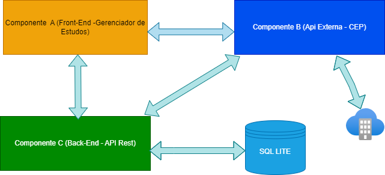

# Back-end (API em REST)


No contexto que vamos colocar em prática o conteúdo apresentado ao longo das aulas explorando a ideia de componentes e serviços. Neste MVP entrego o desenvolvimento de um sistema web nas quais diferentes componentes atuem como serviços autonômos.
Este  projeto faz parte da entrega do MVP da Disciplina **Sprint Desenvolvimento Back-End Avançado** .

O objetivo aqui é apresentar uma API emplementada seguindo o estilo REST.

As principais tecnologias que serão utilizadas aqui é o:
 - [Flask](https://flask.palletsprojects.com/en/2.3.x/)
 - [SQLAlchemy](https://www.sqlalchemy.org/)
 - [OpenAPI3](https://swagger.io/specification/)
 - [SQLite](https://www.sqlite.org/index.html)

---
### Instalação


Será necessário ter todas as libs python listadas no `requirements.txt` instaladas.
Após clonar o repositório, é necessário ir ao diretório raiz, pelo terminal, para poder executar os comandos descritos abaixo.

> É fortemente indicado o uso de ambientes virtuais do tipo [virtualenv](https://virtualenv.pypa.io/en/latest/installation.html).

```
(env)$ pip install -r requirements.txt
```

Este comando instala as dependências/bibliotecas, descritas no arquivo `requirements.txt`.

---
### Executando o servidor


Para executar a API  basta executar:

```
(env)$ flask run --host 0.0.0.0 --port 5000
```

Em modo de desenvolvimento é recomendado executar utilizando o parâmetro reload, que reiniciará o servidor
automaticamente após uma mudança no código fonte. 

```
(env)$ flask run --host 0.0.0.0 --port 5000 --reload
```

---
### Acesso no browser

Abra o [http://localhost:5000/#/](http://localhost:5000/#/) no navegador para verificar o status da API em execução.

---
## Como executar através do Docker

Certifique-se de ter o [Docker](https://docs.docker.com/engine/install/) instalado e em execução em sua máquina.

Utilizo o Docker Desktop for Windows:

**Exemplo de containers inicializados:** 


**Exemplo de images criadas:** 


Navegue até o diretório que contém o Dockerfile e o requirements.txt no terminal.
Execute **como administrador** o seguinte comando para construir a imagem Docker:

```
$ docker build -t apimvp .
```

Uma vez criada a imagem, para executar o container basta executar, **como administrador**, seguinte o comando:

```
$ docker run -p 5001:5001 apimvp
```

Uma vez executando, para acessar a API, basta abrir o [http://localhost:5001/#/](http://localhost:5001/#/) no navegador.


### Alguns comandos úteis do Docker

>**Para verificar se a imagem foi criada** você pode executar o seguinte comando:
>
>```
>$ docker images
>```
>
> Caso queira **remover uma imagem**, basta executar o comando:
>```
>$ docker rmi <IMAGE ID>
>```
>Subistituindo o `IMAGE ID` pelo código da imagem
>
>**Para verificar se o container está em exceução** você pode executar o seguinte comando:
>
>```
>$ docker container ls --all
>```
>
> Caso queira **parar um conatiner**, basta executar o comando:
>```
>$ docker stop <CONTAINER ID>
>```
>Subistituindo o `CONTAINER ID` pelo ID do conatiner
>
>
> Caso queira **destruir um conatiner**, basta executar o comando:
>```
>$ docker rm <CONTAINER ID>
>```
>Para mais comandos, veja a [documentação do docker](https://docs.docker.com/engine/reference/run/).

>```
## Persistência de dados com SQLITE e Docker
>```
>O arquivo db.sqlite3 já faz parte no copy da criação do Dockerfile:


>```

>Para verificar se as operações de CRUD foram realizadas, acesso o container na aba Files no Docker Desktop:
>


>Tem a opção de salvar na máquina e salvo db.sqlite3 com qualquer nome neste diretório local do Docker:
>


>```

>Depois carrego esse arquivo por exemplo utilizando o VSCode e acesso com o SQLite Viewer(plugin no VSCode) e vejo o conteúdo da tabela criada:
>


>```
## Diagrama Arquitetura aplicação MVP (FRONT/BACK)
>```

>